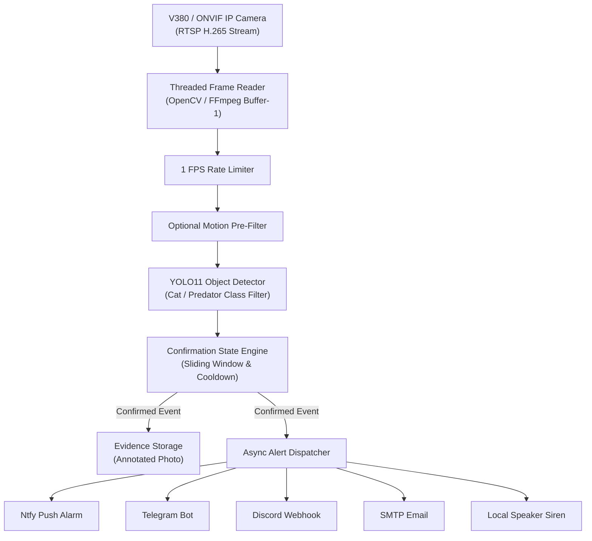

# 🐾 FeralEye: Local AI Predator & Cat Detection Camera Guard

**FeralEye** is a lightweight, edge-optimized, always-running predator detection system designed for IP cameras (V380/ONVIF/RTSP). It continuously monitors sensitive areas (e.g., poultry pens, gardens, livestock) using state-of-the-art YOLO vision models without requiring cloud services, proprietary apps, or recurring subscriptions.

---

## ✨ Features

- **⚡ Lightweight & Fast**: Samples frames at 1 FPS, utilizing `< 2%` CPU on Apple Silicon / edge devices with `yolo11s` / `yolo11n`.
- **🛡️ Sliding-Window Confirmation**: Requires multiple positive detections across a configurable time window (e.g., $\ge 2$ detections in 4 seconds) to eliminate transient false positives.
- **📸 Automated Evidence Capture**: Automatically annotates and archives high-resolution evidence photos with bounding boxes, confidence scores, and timestamps.
- **🚨 Instant Multi-Channel Alerts**:
  - **Ntfy.sh**: Free, instant smartphone push alarms with urgent sirens and attached photos.
  - **Telegram Bot**: Instant photo and metadata push notifications.
  - **Discord Webhooks**: Embedded alert cards in private channels.
  - **SMTP Email**: Full HTML alert emails with photo attachments.
  - **Local Audio Siren**: Physical audio deterrent alarm played through device speakers.
  - **Home Assistant Webhooks**: Smart-home triggers for floodlights, sirens, and sprinklers.
- **🔄 Auto-Healing Stream Ingestion**: Threaded OpenCV & native FFmpeg readers with exponential backoff auto-reconnect.
- **⏱️ Smart Cooldown**: Configurable cooldown (e.g., 3 minutes) prevents notification storms.

---

## 🏗️ Architecture



---

## 🚀 Quick Start

### 1. Clone & Setup Virtual Environment

```bash
git clone https://github.com/MahbbRah/FeralEye.git
cd FeralEye

python3 -m venv venv
source venv/bin/activate
pip install -r requirements.txt
```

### 2. Configure Environment

Copy the example configuration:
```bash
cp .env.example .env
```

Edit `.env` with your camera stream and notification settings:
```ini
# Camera Stream
CAMERA_RTSP_URL=rtsp://192.168.1.233/live/ch00_0
STREAM_BACKEND=opencv

# Detection
MODEL_NAME=yolo11s.pt
TARGET_CLASSES=["cat", "dog"]
CONFIDENCE_THRESHOLD=0.25

# Alerts (Ntfy Push Notification)
NTFY_ENABLED=true
NTFY_TOPIC=my_feraleye_alerts_123
NTFY_PRIORITY=urgent
```

### 3. Run the Service

```bash
python main.py
```

---

## 🧪 Testing & Verification Tools

### Test Camera Stream
```bash
python tests/test_stream.py
```

### Test Smartphone Push Alerts
```bash
python tools/test_alerts.py --channel ntfy
```

### Offline Media Evaluator (Historical Photos / Videos)
```bash
# Evaluate a folder of images/videos
python tools/evaluate.py --source ./test_inputs --classes "cat,dog" --conf 0.25

# Simulate a recorded video clip in real-time
python tools/simulate_stream.py /path/to/recorded_clip.mp4
```

---

## 📂 Project Structure

```
FeralEye/
├── .env.example               # Configuration template
├── config.py                  # Pydantic settings & validation
├── main.py                    # Main service orchestrator
├── requirements.txt           # Minimal dependencies
│
├── camera/                    # RTSP stream readers (OpenCV & FFmpeg)
├── detection/                 # YOLO11 detector & optional motion filter
├── events/                    # Sliding-window state machine & data models
├── evidence/                  # Evidence image annotator & storage
├── alerts/                    # Dispatcher & multi-channel notification providers
├── tools/                     # Evaluation, simulation & alert test utilities
└── utils/                     # Multi-channel structured logger
```

---

## 📱 Running on Android (via Termux) as a 24/7 Dedicated Server

An old or cracked-screen Android phone (4GB+ RAM) makes an incredible, low-power ($< 1\text{W}$), battery-backed 24/7 detection appliance.

### 1. Initial Setup in Termux
1. Install **Termux** from [F-Droid](https://f-droid.org/packages/com.termux/) (do not use Google Play build).
2. Install pre-compiled packages & OpenSSH:
   ```bash
   pkg update && pkg upgrade -y
   pkg install x11-repo tur-repo -y
   pkg install opencv-python python-torch python-torchvision python-numpy python-pillow dbus libglvnd git openssh -y
   ```
3. (Optional) Set up SSH to control the phone from your Mac/PC:
   ```bash
   ssh-keygen -A && passwd && sshd
   # Connect from Mac/PC via: ssh <termux_username>@<phone_ip> -p 8022
   ```

### 2. Clone & Install Python Packages
```bash
git clone https://github.com/MahbbRah/FeralEye.git
cd FeralEye

pip install ultralytics --no-deps
pip install python-dotenv requests pyyaml tqdm
```

### 3. Recommended `.env` for Mobile Phones
In `nano .env`:
```ini
# Use the lightweight sub-stream (640x720) to save mobile CPU
CAMERA_RTSP_URL=rtsp://192.168.1.233/live/ch00_1
STREAM_BACKEND=opencv

# Use the lightweight Nano model
MODEL_NAME=yolo11n.pt
INFERENCE_IMAGE_SIZE=416
DETECTION_FPS=0.5

# Alerts
NTFY_ENABLED=true
NTFY_TOPIC=Predator_alert_fast
NTFY_PRIORITY=urgent
ALERT_COOLDOWN_SEC=180.0
```

### 4. Run 24/7 with Screen Off
```bash
# 1. Prevent Android from sleeping the CPU when display is off
termux-wake-lock

# 2. Start the service (runs in background and logs to file)
nohup python main.py > logs/camera_guard.log 2>&1 &
```
*(To view live logs: `tail -f logs/camera_guard.log` | To stop: `pkill -f main.py`)*

> **Tip:** Go to Android **Settings → Apps → Termux → Battery → Set to "Unrestricted" / "Don't Optimize"** so Android OS never kills the background service.

---

## 📄 License
MIT License
