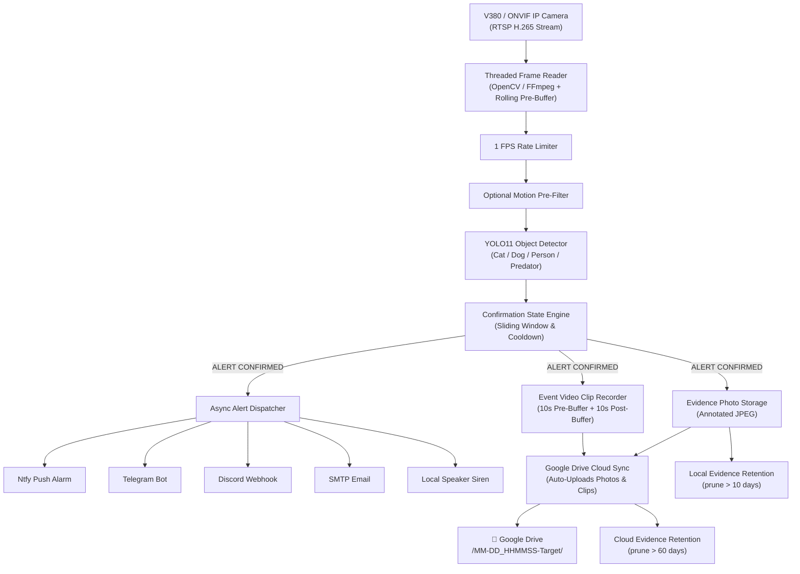

# 🐾 FeralEye: Local AI Predator & Cat Detection Camera Guard

**FeralEye** is a lightweight, edge-optimized, always-running predator detection system designed for IP cameras (V380/ONVIF/RTSP). It continuously monitors sensitive areas (e.g., poultry pens, gardens, livestock) using state-of-the-art YOLO vision models without requiring cloud services, proprietary apps, or recurring subscriptions.

---

## ✨ Features

- **⚡ Lightweight & Fast**: Samples frames at 1 FPS, utilizing `< 2%` CPU on Apple Silicon / edge devices with `yolo11s` / `yolo11n`.
- **🛡️ Sliding-Window Confirmation**: Requires multiple positive detections across a configurable time window (e.g., $\ge 2$ detections in 4 seconds) to eliminate transient false positives.
- **📸 Automated Evidence Capture**: Automatically annotates and archives high-resolution evidence photos with bounding boxes, confidence scores, and timestamps.
- **🎥 Event Video Recording**: Captures footage **BEFORE detection** (rolling memory buffer) + **AFTER detection** into a timestamped `.mp4` video clip — a static 20-second clip (10s pre + 10s post, both configurable).
- **🧹 Automatic Evidence Retention**: Old evidence is pruned automatically — **10 days locally** and **2 months on Google Drive** — so storage never fills up on edge devices (both configurable).
- **☁️ Google Drive Cloud Sync**: Automatically backs up confirmed photos and event video clips into per-event subfolders (`MM-DD_HHMMSS-TARGET_XX/`) on your personal Google Drive (15GB/5TB quota).
- **🚨 Instant Multi-Channel Alerts**:
  - **Ntfy.sh**: Free, instant smartphone push alarms with urgent sirens and attached photos.
  - **Telegram Bot**: Instant photo and metadata push notifications.
  - **Discord Webhooks**: Embedded alert cards in private channels.
  - **SMTP Email**: Full HTML alert emails with photo attachments.
  - **Local Audio Siren**: Physical audio deterrent alarm played through device speakers.
  - **Home Assistant Webhooks**: Smart-home triggers for floodlights, sirens, and sprinklers.
- **🔄 Auto-Healing Stream Ingestion**: Threaded OpenCV & native FFmpeg readers with exponential backoff auto-reconnect.
- **⏱️ Smart Cooldown**: Configurable cooldown (e.g., 3 minutes) prevents notification storms.

---

## 🏗️ Architecture



---

## 🚀 Quick Start

### 1. Clone & Setup Virtual Environment

```bash
git clone https://github.com/MahbbRah/FeralEye.git
cd FeralEye

python3 -m venv venv
source venv/bin/activate
pip install -r requirements.txt
```

### 2. Configure Environment

Copy the example configuration:
```bash
cp .env.example .env
```

Edit `.env` with your camera stream and notification settings:
```ini
# Camera Stream
CAMERA_RTSP_URL=rtsp://192.168.1.233/live/ch00_0
STREAM_BACKEND=opencv

# Detection
MODEL_NAME=yolo11s.pt
TARGET_CLASSES=["cat", "dog", "person"]
CONFIDENCE_THRESHOLD=0.25

# Alerts (Ntfy Push Notification)
NTFY_ENABLED=true
NTFY_TOPIC=my_feraleye_alerts_123
NTFY_PRIORITY=urgent

# Event Video Recording
RECORD_EVENT_VIDEO=true
VIDEO_PRE_BUFFER_SEC=10.0
VIDEO_POST_BUFFER_SEC=10.0

# Evidence Retention (10 days local, 2 months on Drive)
RETENTION_LOCAL_DAYS=10
GDRIVE_RETENTION_DAYS=60

# Google Drive Cloud Sync
GDRIVE_SYNC_ENABLED=false
```

### 3. Run the Service

```bash
python main.py
```

---

## ☁️ Google Drive Cloud Sync Setup

FeralEye can automatically upload confirmed intrusion photos and event video clips to your personal Google Drive (using your 15GB or 5TB personal quota).

### 1. Create Google OAuth Credentials
1. Go to [Google Cloud Console Credentials](https://console.cloud.google.com/apis/credentials).
2. Enable **Google Drive API**.
3. Click **+ CREATE CREDENTIALS** $\rightarrow$ **OAuth client ID** (Application type: **Desktop app**).
4. Copy your **Client ID** and **Client Secret**.

### 2. Generate Your Refresh Token (30 Seconds)
```bash
python tools/get_gdrive_token.py
```
- Paste your `Client ID` and `Client Secret`.
- Open the printed URL in your browser, sign in with your Google account, click **Allow**, and paste the code back into the terminal.

### 3. Put Credentials in `.env`
In `nano .env`:
```ini
GDRIVE_SYNC_ENABLED=true
GDRIVE_OAUTH_CLIENT_ID=your_client_id.apps.googleusercontent.com
GDRIVE_OAUTH_CLIENT_SECRET=GOCSPX-your_client_secret
GDRIVE_OAUTH_REFRESH_TOKEN=1//your_generated_refresh_token
GDRIVE_FOLDER_ID=your_google_drive_folder_id_here
GDRIVE_UPLOAD_VIDEOS=true
GDRIVE_UPLOAD_PHOTOS=true
```
*(To find your `GDRIVE_FOLDER_ID`, open your Google Drive folder in a browser and copy the string after `/folders/` in the URL).*

### 4. Test Google Drive Connection
```bash
python tools/test_gdrive.py
```

---

## 🧪 Testing & Verification Tools

### Test Camera Stream
```bash
python tests/test_stream.py
```

### Test Smartphone Push Alerts
```bash
python tools/test_alerts.py --channel ntfy
```

### Test Google Drive Sync
```bash
python tools/test_gdrive.py
```

### Offline Media Evaluator (Historical Photos / Videos)
```bash
# Evaluate a folder of images/videos
python tools/evaluate.py --source ./test_inputs --classes "cat,dog,person" --conf 0.25

# Simulate a recorded video clip in real-time
python tools/simulate_stream.py /path/to/recorded_clip.mp4
```

---

## 📂 Project Structure

```
FeralEye/
├── .env.example               # Configuration template
├── config.py                  # Pure Python configuration & environment parser
├── main.py                    # Main service orchestrator
├── requirements.txt           # Minimal dependencies
│
├── camera/                    # RTSP stream readers (OpenCV / FFmpeg + rolling pre-buffer)
├── detection/                 # YOLO11 detector with per-class thresholds & poultry rejection
├── events/                    # Sliding-window state machine & data models
├── evidence/                  # Evidence annotator, event clip recorder & retention cleanup
├── cloud/                     # Google Drive Cloud Sync provider (OAuth2 & Service Account)
├── alerts/                    # Dispatcher & multi-channel notification providers
├── tools/                     # Token generator, diagnostics, simulation & evaluator
└── utils/                     # Android patch & multi-channel structured logger
```

---

## 📱 Dedicated Mobile & Edge Deployments

FeralEye is engineered to run seamlessly on low-power devices:
- **Android Smartphones (via Termux)**: Repurpose an old or cracked-screen Android phone (4GB+ RAM) into a dedicated, low-power ($< 1.5\text{W}$), battery-backed 24/7 security appliance.
- **Raspberry Pi & SBCs**: Runs on Linux ARM64 Single Board Computers.
- **macOS / Linux / Windows Servers**: Full hardware acceleration on Apple Silicon (MPS) and NVIDIA GPUs (CUDA).

👉 **For the complete step-by-step Android installation, performance configuration, and troubleshooting guide, see [ANDROID_SETUP_GUIDE.md](./ANDROID_SETUP_GUIDE.md)**.

---

## 📄 License
MIT License
